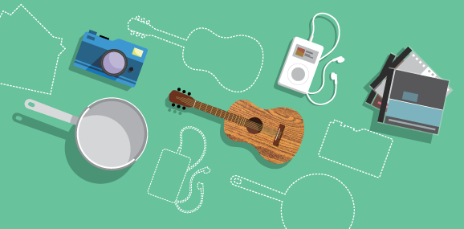

## Decorative illustrations for Freegle emails

Proposed generic 'banner' concept:

This style of image would be cropped to banner dimensions and included in an email just for decoration or to break up the text. I can add more objects, so that there is a larger 'master' wallpaper image from which a variery of banners can be sliced.

---

The same illustrations can be used to represent OFFERED:

... and WANTED:

